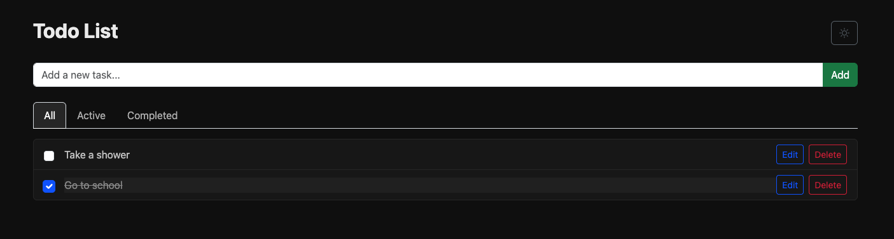

# TodoList

A cloud-native To-Do List application built with Node.js, AWS Lambda, API Gateway, and DynamoDB, designed to demonstrate scalable serverless architecture, IaC with Terraform, CI/CD automation, and full-stack development skills.

## 🌐 Live Demo

You can try the live version of the project here:

👉 <a href="http://todolist-web-frontend.s3-website-ap-southeast-1.amazonaws.com/" target="_blank">http://todolist-web-frontend.s3-website-ap-southeast-1.amazonaws.com/
</a>

The application is hosted on **AWS S3 Static Website Hosting** and powered by a fully serverless backend using **API Gateway, Lambda, and DynamoDB**.

## 🧩 System Architecture

The application is built using a fully serverless architecture on AWS.  
It separates the **frontend**, **API layer**, **business logic**, and **database** clearly,  
resulting in a scalable, cost-efficient, and maintainable system.

Below is the architecture diagram and an explanation of how each component works.

---

### 🔄 How the System Works

#### **1. User Opens the Website**

When the user accesses the application, the browser loads the frontend files  
(**HTML, CSS, JavaScript**) directly from **Amazon S3 Static Website Hosting**.

This provides a fast, reliable, and globally accessible static website.

---

#### **2. Frontend Sends API Requests**

Once the web page loads, the JavaScript code in the browser uses  
`fetch()` or `axios()` to send REST API requests to **API Gateway**.

Available API endpoints:

- `GET /tasks` – fetch all tasks
- `GET /tasks/{id}` – fetch a specific task
- `POST /tasks` – create a new task
- `PUT /tasks/{id}` – update an existing task
- `DELETE /tasks/{id}` – remove a task

---

#### **3. API Gateway Receives the Request**

API Gateway acts as the single entry point for all backend operations.  
It validates the incoming request and forwards it to the correct Lambda function.

This layer allows the system to remain secure and scalable.

---

#### **4. AWS Lambda Processes the Logic**

Each API route is handled by serverless AWS Lambda functions.  
Lambda executes the business logic:

- validate request data
- read/write from DynamoDB
- generate responses

Since Lambda is serverless, it runs only when invoked and scales automatically.

---

#### **5. DynamoDB Stores Task Data**

All task information is stored in a DynamoDB table, including:

- taskId
- title
- taskStatus
- timestamps

DynamoDB offers high performance and requires zero maintenance.

---

#### **6. Response Returns to the Browser**

After processing, Lambda sends back a JSON response through API Gateway,  
and the frontend updates the UI instantly based on the returned data.

---

## 🚀 Features

### 🌗 Light & Dark Theme

- Toggle between **Light** and **Dark** modes.
- Theme preference is saved locally for a consistent user experience.

### 📝 Full CRUD Functionality

- **Create** tasks with validation to prevent empty entries.
- **Read** tasks from DynamoDB via AWS Lambda API.
- **Update** task titles and completion status in real-time.
- **Delete** tasks with instant UI update.
- Fully synchronized with a serverless backend (AWS Lambda + API Gateway + DynamoDB).

### 🔍 Task Filtering

- Filter tasks by:
  - **All**
  - **Active**
  - **Completed**
- Smooth UI transitions and fast rendering.

### ☁️ Serverless Backend

- Built with **AWS Lambda**, **API Gateway**, and **DynamoDB**.
- Infrastructure managed with **Terraform**.
- Scalable, cost-efficient, and fully serverless architecture.

### 📦 CI/CD Deployment Pipeline

- **Frontend** auto-deployed to AWS S3 using GitHub Actions.
- **Backend** auto-deployed via Terraform using GitHub OIDC + IAM Role.
- Independent pipelines:
  - Frontend deploy runs only when frontend files change.
  - Backend deploy runs only when backend/infra files change.

### 📱 Responsive UI

- Mobile-friendly and fully responsive layout.
- Clean, modern, and minimalistic design.

### 🔐 Secure IAM Practices

- Backend uses **OIDC + IAM Role** — no static credentials.
- Frontend uses a restricted **IAM User** with minimal S3 upload permissions.
